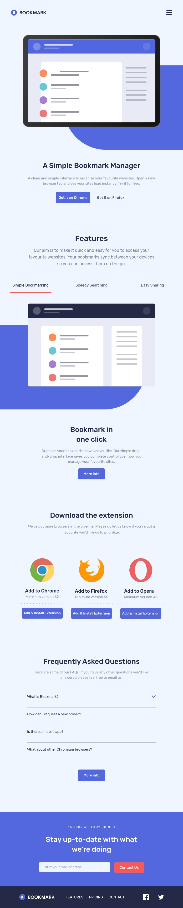
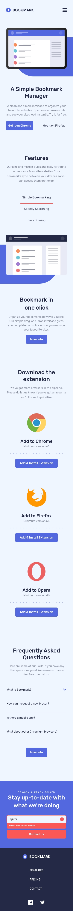
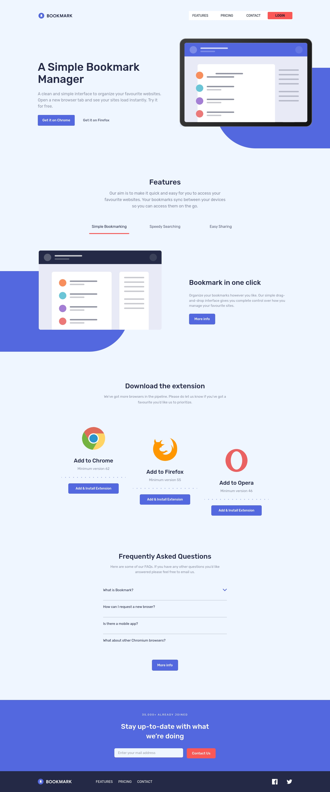
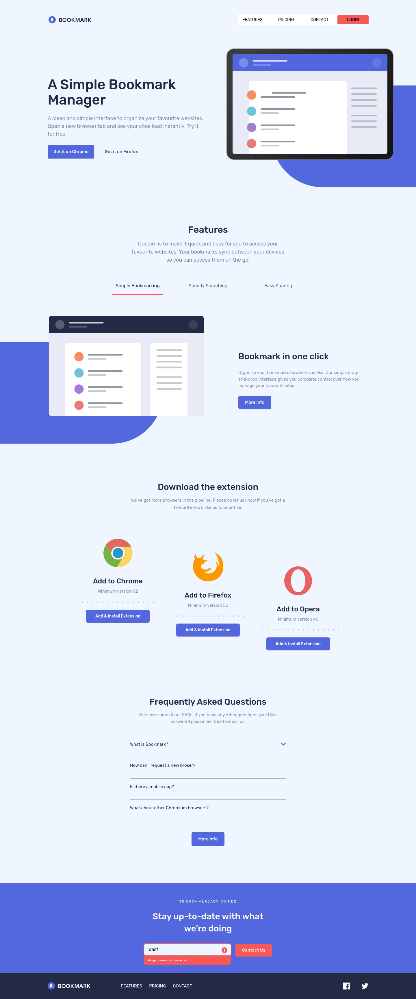

# Frontend Mentor - Bookmark landing page solution

## Table of contents

  - [Screenshot](#screenshot)
  - [Links](#links)
- [My process](#my-process)
  - [Built with](#built-with)
  - [What I learned](#what-i-learned)
  - [Continued development](#continued-development)
  - [Useful resources](#useful-resources)
- [Author](#author)
- [Acknowledgments](#acknowledgments)

### Screenshot

### Links

- Solution URL: [Add solution URL here](https://your-solution-url.com)
- Live Site URL: [Add live site URL here](https://rf1303.github.io/Bookmark-Landing-Page/)

## My process

### Built with

- Semantic HTML5 markup
- CSS custom properties
- Flexbox
- CSS Grid
- TAILWINDCSS
- Mobile-first workflow
- Vanilla Javascript

### What I learned

**TAILWINDCSS

### Useful resources

- [Example resource 1](https://www.youtube.com/watch?v=dAIVbLrAb_Um) 

## Author

- Frontend Mentor - [@yourusername](https://www.frontendmentor.io/profile/yourusername)
- Linkedin - [Ramiro Fernandez](https://www.linkedin.com/in/ramiro-fernandez-260935125/) 

